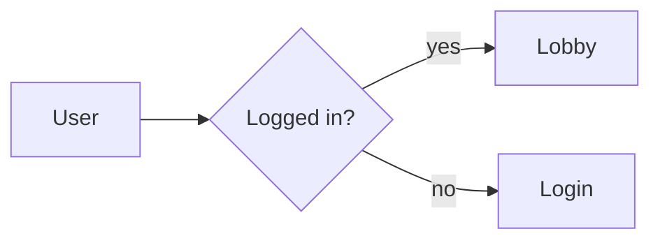

# react-super-mermaid

[](https://www.npmjs.com/package/react-super-mermaid)
[](./LICENSE)
[](#)

> Drop-in React **Mermaid** viewer — beautified themes (Colorful + Excalidraw **sketch**), pan/zoom, in-diagram search, and SVG/PNG export. Loads mermaid **externally** (injected, peer, or CDN) so your app stays light. TypeScript, zero-config styling.

<p align="center">
  
</p>

```tsx
import { MermaidViewer } from 'react-super-mermaid';

<MermaidViewer code={`flowchart LR\n  A[Start] --> B{OK?} --> C[Done]`} toolbar />;
```

## Two signature themes

The same diagram, re-styled after mermaid renders — no config:

| `theme="colorful"` | `theme="sketch"` |
| :---: | :---: |
|  |  |
| modern palette · soft shadows · slate edges | Excalidraw hand-drawn · wobble · handwriting font |

Plus mermaid's native `default` / `dark` / `neutral` / `forest` and `auto`.

> The previews above are styled with the package's real palettes. Run the demo to see live, interactive output (see [Demo](#demo)).

## Features

- 🎨 **Beautified themes** — `colorful` (palette + shadows) and `sketch` (Excalidraw hand-drawn), plus native themes and `auto`.
- 🧰 **Toolbox or diagram-only** — show the built-in toolbar, or just the chart with `toolbar={false}`.
- 🔍 **In-diagram search** — highlight + pan to matches (`/` or `Ctrl/Cmd+F`).
- 🖐️ **Pan & zoom** — fit, actual size, keyboard `+ - 0 1 w` (via `svg-pan-zoom`).
- 📤 **Export** — SVG and high-res PNG/JPEG/WebP (1×/2×/4×, optional transparent background).
- 🪶 **Lightweight & decoupled** — `mermaid`, `svg-pan-zoom`, `react` are **optional peer deps**, never bundled. No Tailwind, no app coupling.
- 🌐 **Load external mermaid** — inject an instance, dynamic-import the peer, or pull from a CDN. Your bundle doesn't carry mermaid.
- 🧩 **TypeScript** — full `.d.ts`. **SSR-safe** import (no top-level DOM access), ships a `'use client'` boundary for Next.js.

## Install

```bash
npm i react-super-mermaid
# mermaid + svg-pan-zoom are OPTIONAL peers — install them to bundle/import locally:
npm i mermaid svg-pan-zoom
```

For **no-build / `<script type="module">`** pages you can load mermaid entirely from a CDN (see below) and install nothing. In a **bundler** (Vite / webpack / Next.js), install `mermaid` as a peer **or** inject an instance.

## Quick start

### With toolbox

This input:



```tsx
import { MermaidViewer } from 'react-super-mermaid';

export default function App() {
  return (
    <div style={{ height: 480 }}>
      <MermaidViewer code={flow} toolbar theme="colorful" />
    </div>
  );
}
```

### Diagram only (no toolbox)

```tsx
import { MermaidDiagram } from 'react-super-mermaid';
// equivalent to <MermaidViewer toolbar={false} ... />

<MermaidDiagram code={code} />;
```

> Give the viewer a sized parent (it fills `height: 100%`).

## Load external mermaid

```tsx
// (a) inject an instance you already imported
import mermaid from 'mermaid';
<MermaidViewer code={code} mermaid={{ instance: mermaid }} />;

// (b) default: dynamic import('mermaid') from your installed peer
<MermaidViewer code={code} />;

// (c) CDN — install nothing (best for no-build pages)
<MermaidViewer
  code={code}
  mermaid={{ cdnUrl: 'https://cdn.jsdelivr.net/npm/mermaid@11/dist/mermaid.esm.min.mjs' }}
/>;
```

Resolution order is **injected → peer import → CDN**, memoized so mermaid loads once per page.

## `MermaidViewer` props

| Prop | Type | Default | Notes |
| --- | --- | --- | --- |
| `code` | `string` | — | **required** mermaid source |
| `theme` | `'colorful' \| 'sketch' \| 'auto' \| 'default' \| 'dark' \| 'neutral' \| 'forest'` | `'colorful'` | toolbar can change it live |
| `dark` | `boolean` | auto (`prefers-color-scheme`) | |
| `toolbar` | `boolean` | `true` | `false` → diagram only |
| `panZoom` | `boolean` | `true` | |
| `search` | `boolean` | `true` | toolbar search |
| `exportable` | `boolean` | `true` | toolbar SVG/PNG export |
| `keyboard` | `boolean` | `true` | shortcuts when the viewer is focused |
| `seed` | `number` | `42` | sketch wobble seed |
| `fontUrl` | `string` | jsDelivr Virgil | sketch handwriting font |
| `mermaid` | `{ instance?, cdnUrl? }` | — | how to obtain mermaid |
| `svgPanZoom` | `{ instance?, cdnUrl? }` | — | how to obtain svg-pan-zoom |
| `mermaidConfig` | `object` | — | passthrough to `mermaid.initialize` |
| `injectStyles` | `boolean` | `true` | inject the package's CSS once |
| `className` / `style` | — | — | on the root element |
| `onRender` | `(svg) => void` | — | after each successful render |
| `onError` | `(err) => void` | — | render/export errors |

### Imperative control (ref)

Useful in diagram-only mode to build your own buttons:

```tsx
import { useRef } from 'react';
import { MermaidDiagram, type MermaidViewerHandle } from 'react-super-mermaid';

const ref = useRef<MermaidViewerHandle>(null);
<MermaidDiagram ref={ref} code={code} />;

ref.current?.zoomIn();
ref.current?.fit();
ref.current?.search('Bob');
await ref.current?.downloadPng('diagram.png', { scale: 4 });
const svgString = ref.current?.exportSvg();
```

Handle: `zoomIn / zoomOut / fit / reset / actualSize / getZoomPercent / search / next / prev / clearSearch / exportSvg / exportPng / downloadSvg / downloadPng / getSvg`.

## Themes & the sketch font

The `sketch` theme uses Excalidraw's **Virgil** handwriting font, fetched at runtime from this package's jsDelivr asset (so it isn't bundled into your JS; the `colorful` default needs no font at all). Override it:

```tsx
<MermaidViewer code={code} theme="sketch" fontUrl="/fonts/Virgil.woff2" />
```

If the font can't load, sketch falls back to `KaiTi / Comic Sans MS / cursive` — rendering never breaks.

## Styling

Styles are injected automatically (`injectStyles` default `true`) — no CSS import needed. Override via CSS variables on `.rsm-root`:

```css
.rsm-root {
  --rsm-accent: #7c3aed;
  --rsm-border: #e2e8f0;
  --rsm-radius: 12px;
}
```

## Keyboard shortcuts

Focus the viewer, then: `/` or `Ctrl/Cmd+F` search · `+`/`-` zoom · `0` fit · `1` actual size · `w` fit width · `Esc` close search.

## Next.js / SSR

The package imports cleanly on the server (no top-level DOM access) and ships a `'use client'` boundary, so you can use it directly in the App Router. mermaid and svg-pan-zoom are only touched at runtime via dynamic import.

## Low-level (framework-agnostic) API

```ts
import { renderDiagram, loadMermaid, colorizeDiagram, sketchifyDiagram } from 'react-super-mermaid';

await renderDiagram({ code, container: '#out', theme: 'colorful' });
```

## Demo

A runnable demo (Vite + React, installs the package from npm) lives in [`example/`](./example):

```bash
cd example
npm install
npm run dev
```

It showcases the toolbox, diagram-only mode with custom ref-driven buttons, every theme, and multiple diagram types.

## License

MIT © [markku636](https://github.com/markku636)
